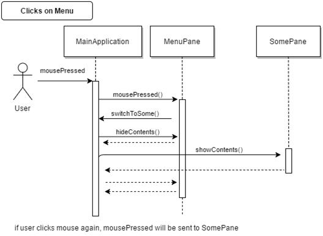

# O-Mazing
## Team Members

Andrei Pelera (j_pelera@u.pacific.edu) : Scrum Master

Ryan Phan (r_nguyen18@u.pacific.edu) : Product Owner

John Lam (j_lam31@u.pacific.edu) : Team Member

Divine Atah (d_atah@u.pacific.edu) : Team Member 

## Description
"O-Mazing" is an educational game that is designed to teach players about Big-O notation. In the game, players will navigate a maze that will have objects that have certain buffs and debuffs to learn more about the different orders of growth of algorithms. 

As players move through the maze, the items they pick up will apply a movement speed reduction or a boost of speed to provide clear examples of Big-O notation. This is hopefully allow players to learn the impact that it has on the performance of algorithms.

To make the learning experience more engaging and interactive, the game will include animations and sound effects that will provide visual and audio feedback for each choice the player makes.

Overall, "O-Mazing" will be a fun and effective way to learn more about Big-O notation and its importance in programming.

## Components
1. Windows PC, macOS, Linux
2. Eclipse
3. Java

## UML Class Diagram for files provided

## UML Sequence Diagram for files provided

